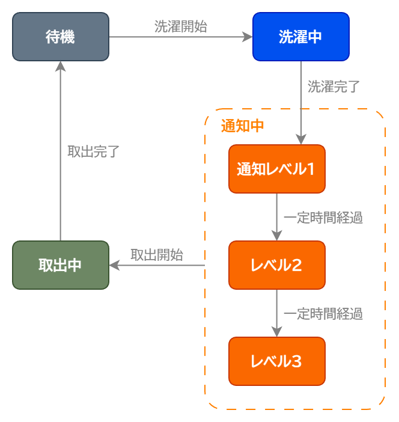

# RaundryCycle

洗濯物の干し忘れを防止するため、洗濯機の動作停止後、洗濯物を取り出すまで通知し続けるシステム。

現時点ではMVPのみ実装。

## 要件

- M5Stack
- MicroPython

## インストール

1. 以下からファームウェアを入手する  
   https://github.com/m5stack/M5Cloud/tree/master/firmwares/OFF-LINE

2. [esptool](https://github.com/espressif/esptool)でファームウェアを書き込む  
    ```
    esptool --chip esp32 --port ポート名 erase-flash
    esptool --chip esp32 --port ポート名 write-flash 0x1000 ファイル名
    ```

3. シリアルコンソールに接続する

4. 以下のコードを入力する
    ```python
    def write_file(filename):
        with open(filename, 'w') as file:
            try:
                while True:
                    print(input(), file=file)
            except EOFError:
                print('done!')
    ```

5. 以下のコードを入力する
    ```python
    write_file('boot.py')
    ```

6. `boot.py`の内容を貼り付ける

7. Ctrl+Dを押す

8. 以下のコードを入力する
    ```python
    write_file('laundrycycle.py')
    ```

9. `laundrycycle.py`の内容を貼り付ける

10. Ctrl+Dを押す

上記手順の完了後、フォルダ構成は以下の通りとなっている。

```
/flash
├─ boot.py
└─ laundrycycle.py
```

## 使い方

1. M5Stackを電源に接続する
2. 待機画面が表示される
3. 洗濯を開始したら、「START」ボタンを押す
4. 洗濯が完了したら、ブザーが鳴る  
   (MVPにおける洗濯完了の条件はタイマー方式であり、30分後に選択が完了したとみなす)
5. 洗濯物の取り出しを開始したら「STOP」ボタンを押す
6. 洗濯物の取り出しを完了したら「END」ボタンを押す
7. 2に戻る

## 状態遷移図



注意: 通知レベルは未実装

## 画面表示例


## 拡張計画

| 項目 | MVP | 拡張1 | 拡張2 |
| --- | --- | --- | --- |
| 洗濯開始検出方式 | ボタン | 振動 | 振動+電流 |
| 洗濯完了検出方式 | タイマー | 振動 | 振動+電流 |
| 取出開始検出方式 | ボタン | 未定 | 未定 |
| 取出完了検出方式 | ボタン | 未定 | 未定 |
| レベル1通知方式 | M5Stack内臓ブザー | 未定 | 未定 |
| レベル2通知方式 | 無し | 未定 | 未定 |
| レベル3通知方式 | 無し | 未定 | 未定 |
