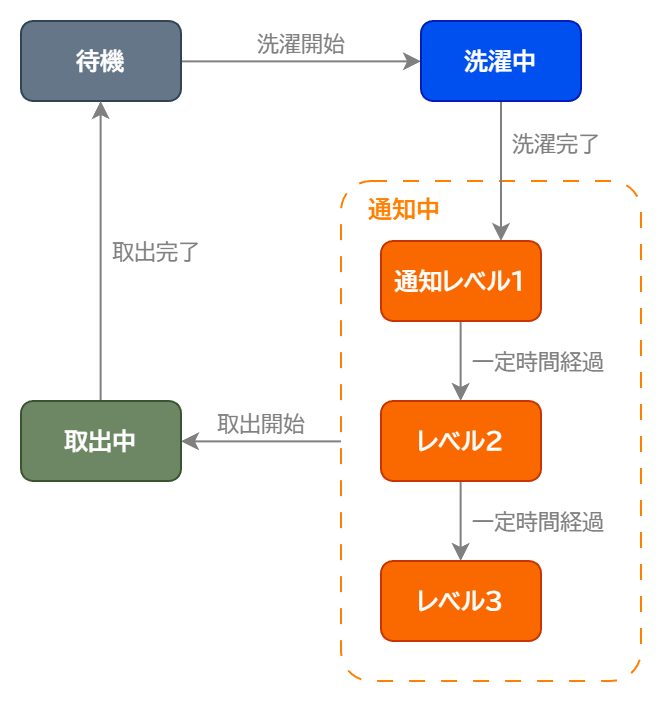
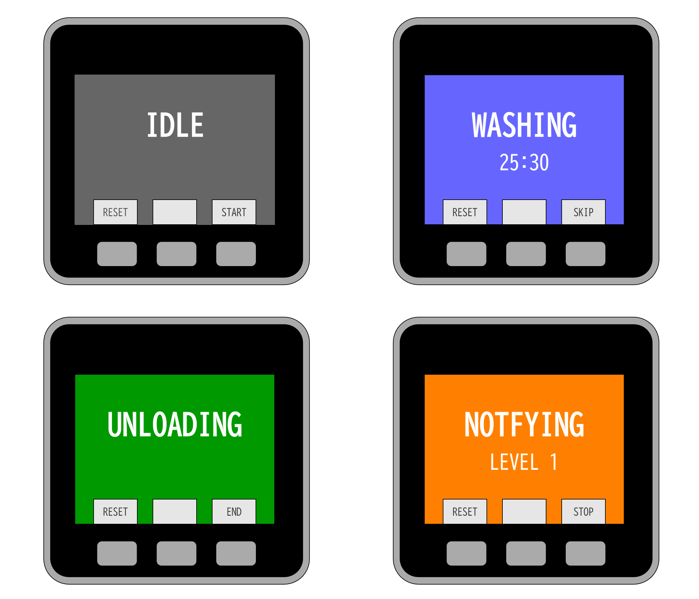

# LaundryCycle

洗濯物の干し忘れを防止するため、洗濯機の動作停止後、洗濯物を取り出すまで通知し続けるシステム。

現時点ではMVPのみ実装。

## 要件

- M5Stack
- MicroPython
- SDカード(FAT32でフォーマット済み)  
  ※加速度ロギング用。無くても本体機能は動作する

## インストール

1. 以下からファームウェアを入手する  
   https://github.com/m5stack/M5Cloud/tree/master/firmwares/OFF-LINE

2. [esptool](https://github.com/espressif/esptool)でファームウェアを書き込む  
    ```
    esptool --chip esp32 --port ポート名 erase-flash
    esptool --chip esp32 --port ポート名 write-flash 0x1000 ファイル名
    ```

3. [mpremote](https://docs.micropython.org/en/latest/reference/mpremote.html)でファイルをアップロードする  
    ```
    python -m mpremote fs cp src/boot.py :
    python -m mpremote fs cp src/main.py :
    python -m mpremote fs cp src/accellogger.py :
    ```


上記手順の完了後、フォルダ構成は以下の通りとなっている。

```
/flash
├─ boot.py
├─ main.py
└─ accellogger.py
```

## 使い方

1. M5Stackを電源に接続する
2. 待機画面が表示される
3. 洗濯を開始したら、「START」ボタンを押す
4. 洗濯が完了したら、ブザーが鳴る  
   (MVPにおける洗濯完了の条件はタイマー方式であり、30分後に選択が完了したとみなす)
5. 洗濯物の取り出しを開始したら「STOP」ボタンを押す
6. 洗濯物の取り出しを完了したら「END」ボタンを押す
7. 2に戻る

## 状態遷移図



注意: 通知レベルは未実装

## 画面表示例



## 加速度ロギング

拡張1の振動による洗濯開始/完了検出に向けて、振動パターン解析用の教師データを収集するため、M5Stack内蔵のIMU(MPU9250)の加速度をSDカードにCSV形式で記録する。

動作概要:

- 別スレッドで約100Hz(10ms周期)でサンプリングし、メインループの動作には影響を与えない
- 待機状態(IDLE)中はSDカードへ書き込まず、直近約30秒分をメモリ上のリングバッファに保持する
- 洗濯状態(WASHING)へ遷移すると`/sd/accel/NNNN.csv`(連番)を新規作成し、リングバッファの内容(遷移前約30秒分)を先頭に書き出したうえで記録を継続する
- 待機状態に戻るとファイルをクローズする(1回の洗濯セッションにつき1ファイル)
- 各行には記録時点の状態がラベルとして付与されるため、ボタン操作を正解ラベルとした解析に利用できる

CSVフォーマット:

```
ticks_ms,state,x,y,z
1234567,1,0.0123,-0.9812,9.7734
```

| 列 | 内容 |
| --- | --- |
| `ticks_ms` | サンプル時刻(`time.ticks_ms()`による相対時刻。ラップするため解析時は差分で扱う) |
| `state` | 状態ID(1=IDLE(プレトリガ), 2=WASHING, 3=NOTIFYING, 4=UNLOADING) |
| `x`, `y`, `z` | 加速度 [m/s²] (小数4桁) |

注意事項:

- SDカード未挿入またはIMU初期化失敗時は、起動時に待機画面へ`ACCEL LOG OFF`と表示され、ロギングのみ無効となる(本体機能は通常通り動作する)
- リングバッファ書き出し中(約1〜3秒)はサンプリングにギャップが生じる

## 拡張計画

| 項目 | MVP | 拡張1 | 拡張2 |
| --- | --- | --- | --- |
| 洗濯開始検出方式 | ボタン | 振動 | 振動+電流 |
| 洗濯完了検出方式 | タイマー | 振動 | 振動+電流 |
| 取出開始検出方式 | ボタン | 未定 | 未定 |
| 取出完了検出方式 | ボタン | 未定 | 未定 |
| レベル1通知方式 | M5Stack内臓ブザー | 未定 | 未定 |
| レベル2通知方式 | 無し | 未定 | 未定 |
| レベル3通知方式 | 無し | 未定 | 未定 |


## ライセンス

本プロジェクトはMITライセンスの下で公開されている。詳細は[LICENSE](LICENSE)ファイルを参照。
