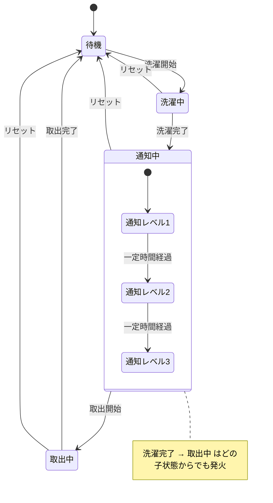
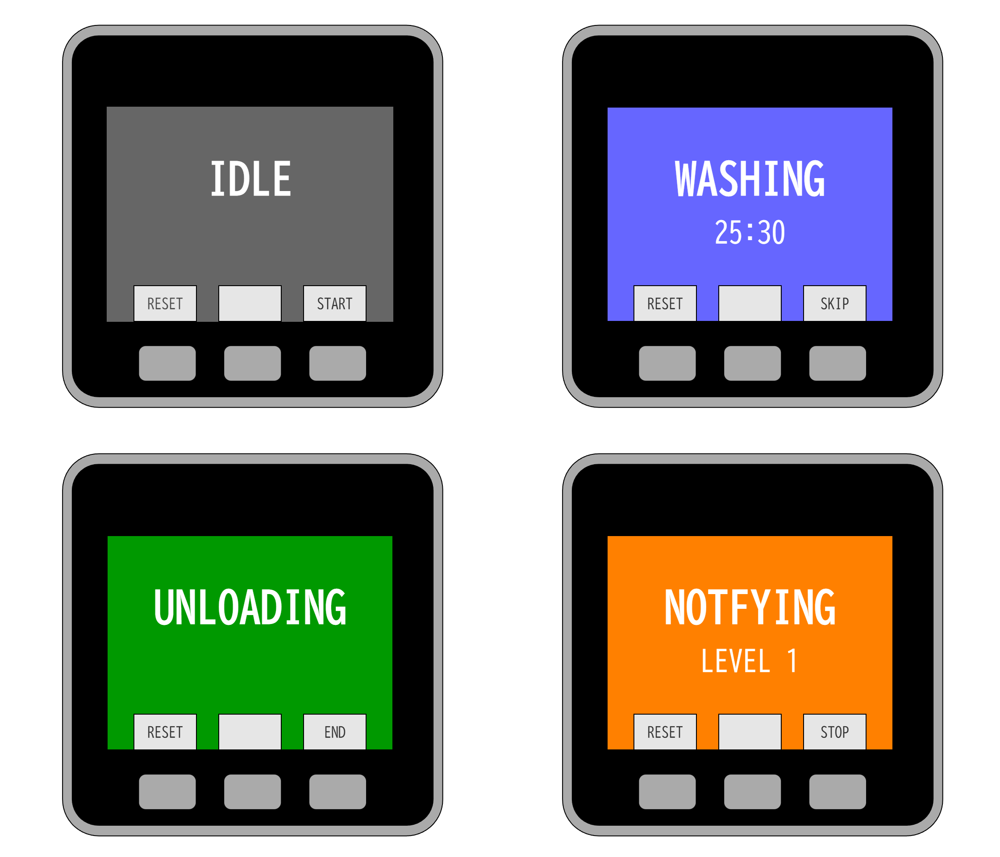
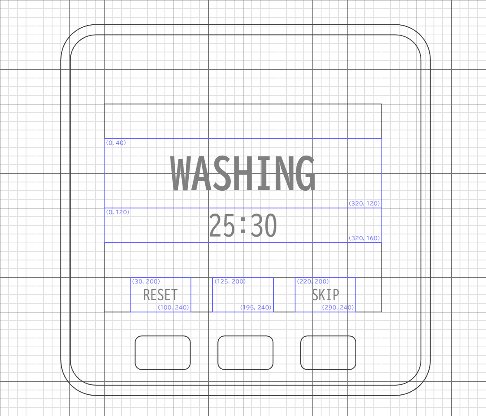

# 詳細設計

## 状態遷移図

## 状態一覧

| ID | 日本語名 | 説明 |
| --- | --- | --- |
| `ST_IDLE` | 待機 | 洗濯機がオフ |
| `ST_WASHING` | 洗濯中 | 洗濯機の運転を検知した後、完了待ち |
| `ST_NOTIFYING` | 通知中 | 洗濯機の運転停止を検知し、通知エスカレーション中 |
| `ST_UNLOADING` | 取出中 | 洗濯物の取出作業中 |

## 通知レベル一覧（未実装）

| ID | 日本語名 | 説明 |
| --- | --- | --- |
| `NL_LEVEL_1` | 通知レベル1 | 初期通知 |
| `NL_LEVEL_2` | 通知レベル2 | 音声・光 |
| `NL_LEVEL_3` | 通知レベル3 | 断続的な警告音・光 |

## イベント一覧

| ID | 日本語名 | 発生源 |
| --- | --- | --- |
| `EV_WASH_BEGIN` | 洗濯開始 | 電流/振動/ボタン |
| `EV_WASH_END` | 洗濯完了 | 電流/振動/完了音 |
| `EV_UNLOAD_BEGIN` | 取出開始 | フタ姿勢/ボタン |
| `EV_UNLOAD_END` | 取出完了 | フタ姿勢/ボタン |
| `EV_RESET` | リセット | ボタン |

## 画面設計

